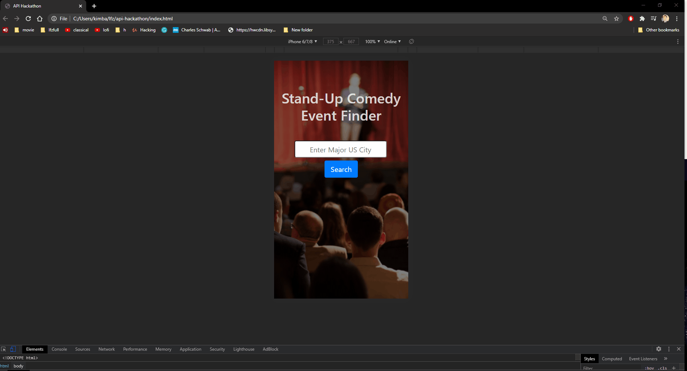

# comedy-event-finder
A hackathon project utilizing the data from two public APIs to create an application.

## Technologies Used

- JavaScript
- Bootstrap 4
- jQuery
- HTML5
- CSS3

## Live Demo

Try the application live at [https://kimballtyler.github.io/comedy-event-finder/](https://kimballtyler.github.io/comedy-event-finder/)

## Features

- User can view all pages.
- User can search city and call database.
- User can see events for city.
- User can choose event to see info and directions.

## Preview



## Development

### Getting Started

1. Clone the repository.

    ```shell
    git clone https://github.com/kimballtyler/comedy-event-finder.git
    cd api-hackathon
    ```

1. Start the project. Once started you can view the application by opening your `index.html` file in your browser.
